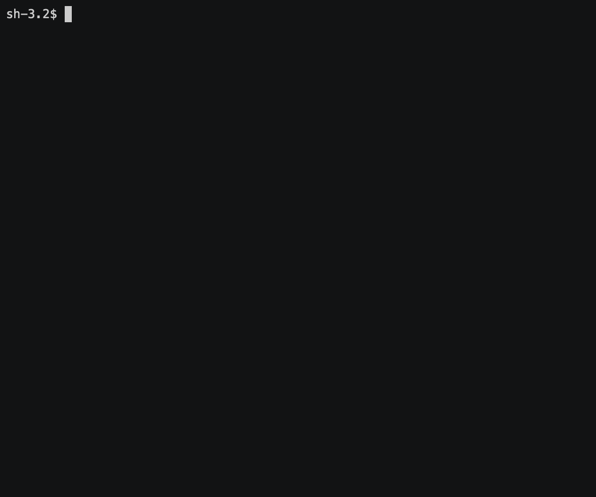

# Building A Programming Language From Scratch
## The Quentin Tarantino Inspired Salami-Lang

### Overview

Over the past few weeks, I have been trying to find some good documentation
on how to build an interpreted language. There's a lot out there and it
was a bit overwhelming. There's a lot of in-the-weed docs that were amazing
once you were ready for them, but I found it hard to get from the high-level
to the low-level. This will be the main point of this project - to talk about
what components are critical for an interpreted language, then guide ourselves
into the nitty-gritty.

Also - as an FYI - I won't be going through each line of code in detail in this
project. However, I empower you to go to my [GitHub Repo]() and check out all of
the code that you would like. Feel free to open issues, ask me questions, add
functionality, etc.

So, what are we building? We'll we are going to build an interpreted language.
It's called salami, but it resembles a lot of code you've seen in other 
languages (with a twist). Let's look at the below code snippet:

```shell
gorlami sq(a) {
    dicocco a * a;
}

gorlami add(a, b) {
    if (a < b) {
        dicocco sq(a) + b;
    }
    dicocco a + b;
}
    

var x = 5;
var y = 10;
exit add(x, y);
```

If we ran the above, we would expect to see a return value of 35.

We use the `gorlami` keyword to define a function, much like golang's `fn` 
keyword or python's `function` keyword. We then return values from functions
with `dicocco`. If you aren't familiar with Gorlami or Dicocco, do yourself a 
favor and watch [this clip](https://www.youtube.com/watch?v=krtnt191Drg).

We will define:
* variables with the `var` keyword
* functions with the `gorlami` keyword
* return values with the `dicocco` keyword
* exit codes with the `exit` keyword

We will also support greater than, less than, assignment, and mathematical 
operations.

For a live demo using the [functions.salami](./examples/functions.salami) file, 
see the below video:




### Components Of An Interpreted Programming Language

There are a few components of an interpreted programming language.

1. Source Code: This is the human-readable code written by the programmer 
    in the interpreted language.
2. Tokens: Tokens are the indiviual characters or set of characters from the
    source code. They comprise the operations, keywords, identifiers, etc. that
    your language is going to support.
3. Lexer: The lexer takes the source code as input and breaks it down into tokens. 
    For example, the lexer would take something like `var x = 3;` and break it into 
    the tokens: `var`, `x`, `=`, `3`, `;`.
4. Parser: The parser takes the tokens produced by the lexer and organizes them 
    into a structured format called an Abstract Syntax Tree (AST). The AST is a tree 
    representation of the syntactic structure of the code. Each node in the tree 
    represents a construct occurring in the source code. Going off of our previous example,
    the code var x = 5; might be represented in the AST with a variable declaration 
    node containing a variable name x and a value 5.
5. Abstract Syntax Tree: The AST is a hierarchical tree structure that 
    represents the syntax of the source code in a way that makes it easier to 
    analyze and interpret.  Each node in the AST represents a different construct 
    in the language, such as expressions, statements, and control flow structures.
6. Interpreter: The interpreter traverses the AST and executes the program. It evaluates 
    expressions, executes statements, and handles control flow. The interpreter directly 
    executes the instructions defined by the AST nodes without needing to compile them 
    into machine code.
7. Environment: The environment, or scope, keeps track of variable bindings, 
    function definitions, and other context-specific information during execution.
    Essentially, it helps manage the state of the program as it runs, ensuring that 
    variables are correctly scoped and accessible.
8. Runtime: The runtime system provides the underlying infrastructure needed for 
    the interpreted language to operate. This can include memory management, input/output 
    operations, and other essential services. It supports the execution of the 
    code by providing built-in functions and handling interactions with the system.


### Example Of An Interpreted Program

Let's say the user has given us the following source code (1):

```shell
gorlami add(a, b) {
    dicocco a + b;
}

var x = 5;
var y = 10;
var z = add(x, y);
exit z;
```

The Lexer would then break this into the following tokens (2 and 3):

* FUNCTION
* IDENT(add)
* LPAREN
* IDENT(a)
* COMMA
* IDENT(b)
* RPAREN
* LBRACE
* RETURN
* IDENT(a)
* PLUS
* IDENT(b)
* RBRACE
* VAR
* IDENTIFIER(x)
* ASSIGN
* INT(5)
* VAR
* IDENT(y) 
* ASSIGN 
* INT(10)
* VAR
* IDENT(z) 
* ASSIGN
* IDENT(add)
* LPAREN
* IDENT(x) 
* COMMA 
* IDENT(y)
* RPAREN
* EXIT
* IDENT(z)

The parser would then organize these tokens into an AST (4 and 5):

```
Program
├── FunctionStatement
│   ├── Name: add
│   ├── Parameters: [a, b]
│   └── Body:
│       └── ReturnStatement
│           └── BinaryExpression
│               ├── Left: a
│               └── Right: b
├── VarStatement: x = 5
├── VarStatement: y = 10
├── VarStatement: z = add(x, y)
├── ExitStatement: z
```

The interpreter then goes ahead and traverses this AST (6):

1. It evaluates the function definition for add.
2. It assigns values to x and y.
3. It calls the add function with arguments x and y, 
    computes the result, and assigns it to z.
4. It exits the program with the value of z.


The environment (7) keeps track of the variables x, y, z, and the function add
throughout the lifecycle of this program.

The runtime (8) system manages the execution, including memory management for 
variable assignments and function calls.

### Tokens
So, what are tokens with some actual backing? Well, you can think of them as a 
dictionary for atomic pieces of source code. How should you language handle 
parentheses? How about curly braces? If your app needs to care about them, they
should be tokens. Do you have keywords? Well, then those could also be tokens.

If we look at a snippet of the salami tokens, we see:

```golang
    .
    .
    .
	IDENT     = "IDENT"
	INT       = "INT"
	ASSIGN    = "="
	PLUS      = "+"
	MINUS     = "-"
	ASTERISK  = "*"
	SLASH     = "/"
	SEMICOLON = ";"
	GT        = ">"
	LT        = "<"

	LPAREN = "("
	RPAREN = ")"
	LBRACE = "{"
	RBRACE = "}"
	COMMA  = ","

    VAR      = "VAR"
	IF       = "IF"
	ELSE     = "ELSE"
	TRUE     = "TRUE"
	FALSE    = "FALSE"
	EXIT     = "EXIT"
	FUNCTION = "FUNCTION"
	RETURN   = "RETURN"
    .
    .
    .
```

So our program will be able to handle:
* Identifiers (variable/function names)
* Integers
* Assignment with the `=` operator
* Mathematical operations with `+`, `-`, `*`, `/`
* etc.

We might also have keywords:

```golang
var keywords = map[string]TokenType{
	"var":     VAR,
	"if":      IF,
	"else":    ELSE,
	"true":    TRUE,
	"false":   FALSE,
	"exit":    EXIT,
	"gorlami": FUNCTION,
	"dicocco": RETURN,
}
```

The above tells us that `var` is a special word. When we see
a token of type `VAR`, we should treat it as the `var` keyword.
This will be assigned some more meaning in the parser when we actually
have different node types in our AST. But, if you were wondering why
`dicocco` was a return statement, this is why!

### Lexer
We now know the pieces that make up our language, but we need a way to read
soure code line-by-line and character-by-character. That's where the lexer comes in.

A lexer needs to keep track of whatever character it is reading and try to map that 
into a token that our language supports. A lexer's `Lex` function does just that. It
reads a character (or set of characeters), interprets its meaning, and returns the 
position and token type to the caller. Let's look at Salami's Lexer below:

```golang
func (l *Lexer) Lex() (LexPosition, tok.TokenType, string) {
	for {
        // Read a rune from the reader
		r, _, err := l.reader.ReadRune()
		if err != nil {
			if err == io.EOF {
				return l.pos, tok.EOF, ""
			}

			panic(err)
		}

        // move to the next position
		l.pos.Column++
		switch r {
		case '\n':
			l.handleNewLine()
        // return an assignment operator
		case '=':
			return l.pos, tok.ASSIGN, "="
        // return a plus operator
		case '+':
			return l.pos, tok.PLUS, "+"
        // return a minus operator
		case '-':
			return l.pos, tok.MINUS, "-"
        // ...
		case '*':
			return l.pos, tok.ASTERISK, "*"
		case '/':
			return l.pos, tok.SLASH, "/"
		case ';':
			return l.pos, tok.SEMICOLON, ";"
		case '(':
			return l.pos, tok.LPAREN, "("
		case ')':
			return l.pos, tok.RPAREN, ")"
		case '{':
			return l.pos, tok.LBRACE, "{"
		case '}':
			return l.pos, tok.RBRACE, "}"
		case '>':
			return l.pos, tok.GT, ">"
		case '<':
			return l.pos, tok.LT, "<"
		case ',':
			return l.pos, tok.COMMA, ","
		default:

			if unicode.IsSpace(r) {
				continue // nothing to do here, just move on
			} else if unicode.IsDigit(r) {
                // If this is a number, we should try to read the whole
                // thing, return the token type as int, and the whole
                // integer that was read
				starts := l.pos
				l.goBack()
				literal := l.readDigit()
				return starts, tok.INT, literal
			} else if unicode.IsPrint(r) {
                // If this is a string, we should try to read the whole
                // thing and then lookup the type of keyword it is
				starts := l.pos
				l.goBack()
				literal := l.readIdentifier()
				return starts, tok.KeywordLookup(literal), literal

			} else {
				return l.pos, tok.ILLEGAL, string(r)
			}
		}
	}
}
```

### Parser + AST

### Interpreter

### Environment

### Runtime